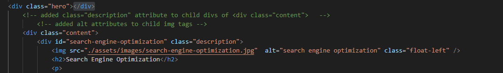
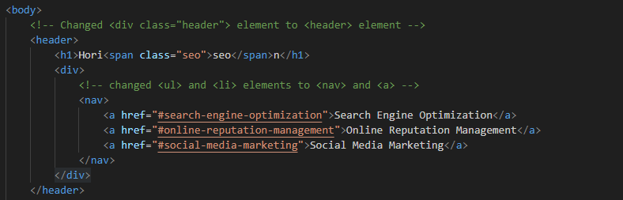
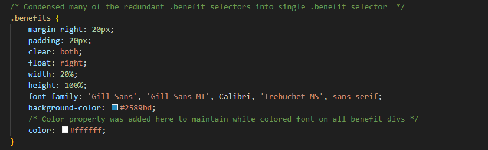

# Horiseon Refactor

## Description

The purpose of this project was two-fold; the first was to incorporate certain accessibility features that were missing in Horiseon's initial design and the second was to improve Horiseon's codebase by refactoring it and reducing redudancies by either consolidating certain CSS selectors into a single selector that fulfilled the same function or by changing certain html elements into semantic html elements, or in some cases both.

These changes will optimize Horiseon for search engines by bringing the site up to their standards of accesibility. 

## Usage

As you browse the source code you will encounter comments detailing the changes that were incorporated into the files:

*In this screenshot, you can see an "alt" attribute was added to the img tag.*

The second was to refactor the Horiseon index.html and CSS files in order to reduce redudancy.

*In this screenshot, you can see an example of comment detailing the exact element that was refactored.*

*Another example of a refactor, this time in the CSS file.*

These comments have been written over every change in both files so that future developers can see what specific changes were made during refactoring. The aim of these comments is to make it easier for developers to incorporate their own changes and improvments should they deem further refactoring to be necessary or if technologies develop further.  

## Built With

* [HTML](https://developer.mozilla.org/en-US/docs/Web/HTML)
* [CSS](https://developer.mozilla.org/en-US/docs/Web/CSS)

## Deployed Link
[Visit Horiseon](https://chapjae.github.io/horiseon-challenge/)
[Link to Horiseon Repo] ()

## Authors

**Jay Liu**

[Link to Github](https://github.com/Chapjae)